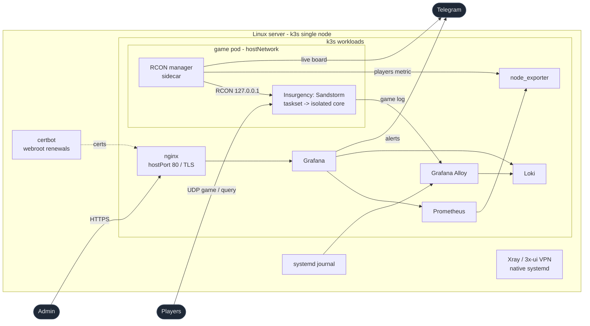

# Server Infrastructure as Code

[](https://github.com/rkarpovets/server-infrastructure/actions/workflows/ci.yml) [](https://github.com/rkarpovets/server-infrastructure/actions/workflows/cd.yml) [](https://github.com/rkarpovets/server-infrastructure/actions/workflows/terraform.yml)

Ansible automation that takes a clean Ubuntu host and provisions a complete,
production-grade Linux server on a single-node **Kubernetes (k3s)** cluster:
base hardening, a full **observability stack** (metrics **and** logs with
Telegram alerting), an Nginx reverse proxy with TLS, an Xray (3x-ui) VPN panel,
and a dedicated **Insurgency: Sandstorm** game server pinned to a fully
**isolated CPU core** - all described as code and fully **idempotent**.

Ansible stays the single source of truth and the only deploy mechanism: it
renders the Kubernetes manifests from vault-backed variables and applies them
through `kubernetes.core.k8s`. One `site.yml` run provisions the production
host from scratch, which makes disaster recovery and migration to new hardware
a repeatable operation.

> Hostnames, IPs and the live firewall port map are intentionally **not** in the
> repo: the production IP, TLS domain and non-standard ports all live encrypted
> in Ansible Vault, so a public clone never reveals the live host.

## Highlights

- **Kubernetes without the ceremony** - k3s single-node with Traefik/ServiceLB
  disabled (the host already owns 80/443), NodePorts bound to loopback only
  (kube-proxy NATs around the host firewall - a lesson this repo encodes),
  manifests templated and applied by Ansible, no Helm, no registry.
- **A quiet core for the game** - `isolcpus`/`nohz_full`/`rcu_nocbs` + IRQ
  steering carve one core out of the scheduler entirely; the single-threaded
  game server is pinned to it with `taskset`, and a hot mod.io SDK thread is
  evicted back to the general cores by a host-side timer.
- **Game + RCON manager as one pod** - the Python manager runs as a sidecar
  (no shared process namespace: it talks to the game only over loopback RCON).
  The manager heals what RCON can reach; if the game hangs so hard RCON stops
  answering, the kubelet liveness probe restarts the pod. **Nothing restarts
  the game automatically on config changes** - that is always a deliberate,
  manual rollout in a no-players window.
- **Observability as code** - Prometheus, Grafana, Loki, node_exporter and Alloy
  in-cluster, with datasources, dashboards, alert rules, contact points and
  notification policies all provisioned from files (no click-ops).
- **CI that sees the real YAML** - every PR renders the k8s manifests with dummy
  secrets and validates them with kubeconform, next to yamllint and ansible-lint;
  a scheduled pipeline runs `--check` against production daily and reports drift
  (the `kubernetes.core.k8s` module diffs the live cluster objects in check mode).
- **Secrets in Ansible Vault** - the repo shows *which* secrets exist, never their
  values; the vault password lives outside the repo.
- **Idempotent by design** - a second run reports `changed=0`; version-pinned,
  heavy installs (steamcmd, 3x-ui, k3s) only act when state actually differs.

## Architecture



Xray stays native on purpose: it works at the network layer (443, VPN inbounds)
where containerization buys nothing and complicates everything. A mixed runtime
is a decision, not an accident.

## Roles

| Role | What it does |
|------|--------------|
| `common`      | Base packages, timezone, apt hygiene |
| `security`    | UFW firewall, fail2ban (systemd backend), SSH hardening drop-in |
| `host_tuning` | Full CPU-core isolation for the game: GRUB (`isolcpus`, `nohz_full`, `rcu_nocbs`) + IRQ affinity steering |
| `k3s`         | k3s install (pinned, Traefik/ServiceLB disabled, loopback-only NodePorts), kubeconfig for the admin user |
| `monitoring`  | node_exporter (DaemonSet) + Prometheus + Grafana; datasources, dashboards, alert rules, Telegram contact point - all rendered into ConfigMaps/Secrets and applied as manifests |
| `logging`     | Loki + Grafana Alloy; tails the game log and the systemd journal, 7-day retention, queryable in the same Grafana |
| `nginx`       | nginx Deployment on hostPort 80/TLS: fronts Grafana, serves ACME webroot renewals, keeps file logs for the fail2ban jails |
| `xray`        | Native 3x-ui install (pinned binary + systemd), one-time DB restore |
| `sandstorm`   | steamcmd dedicated server + mod.io mods on the host filesystem, game configs, and the two-container game pod (game + RCON-manager sidecar) |
| `backup`      | Daily restic backup of the non-reproducible state (3x-ui VPN DB, TLS certs) to Cloudflare R2, client-side encrypted; systemd timer + a heartbeat metric that drives a stale-backup alert |

Applied in dependency order by `site.yml`: `common -> security -> host_tuning ->
k3s -> monitoring -> logging -> nginx -> xray -> sandstorm -> backup`.

## Repository layout

```
ansible/
├── ansible.cfg
├── site.yml                       # entry point - the whole stack
├── inventory/
│   ├── hosts.yml                  # inventory hosts
│   └── group_vars/
│       ├── all/
│       │   ├── main.yml           # shared vars + secret aliases
│       │   └── vault.yml          # ansible-vault encrypted secrets
│       └── production.yml         # production overrides (ports/domain via vault)
└── roles/                         # one responsibility per role
    └── */templates/k8s/           # Kubernetes manifests (Jinja2-templated)
terraform/                         # Cloudflare R2 backup bucket as code
docs/MIGRATION.md                  # disaster-recovery / new-host runbook
docs/DEPLOY-CHECKLIST.md           # pre-flight checklist for a new-IP deploy
scripts/render-k8s-manifests.py    # CI: render manifests with dummy secrets for kubeconform
```

Backups: see [docs/BACKUP.md](docs/BACKUP.md) for the restic/R2 setup and the restore runbook.

## Configuration and host specifics

Everything host-specific - IPs, ports, TLS domain, firewall rules - is expressed
through `group_vars` and Ansible Vault, never by editing roles. Host facts that
cannot be assumed are resolved at deploy time (the game pod runs as the *actual*
uid of the steam user, looked up via `getent` - hardcoding uid 1000 is exactly
the kind of assumption that once crash-looped a cutover).

## Secrets & Vault

All secrets live in `inventory/group_vars/all/vault.yml`, encrypted with
**Ansible Vault** (AES-256). Plaintext aliases in `all/main.yml` and
`production.yml` reference the encrypted values, so the repo documents *which*
secrets exist without ever exposing them:

- Grafana admin password
- Telegram bot tokens (a monitoring bot and a dedicated game bot) + chat id
- Sandstorm RCON password, GSLT, and game-stats tokens
- mod.io API token
- Production host: IP, TLS domain, and non-standard SSH / panel / VPN ports

The vault password is kept outside the repository. The encrypted `vault.yml`
**is** committed - that is what makes a clean clone able to rebuild production.

## Observability

A single Grafana fronts both pillars:

**Metrics** - `node_exporter` (incl. textfile collectors for systemd unit states
and the game's own metrics) is scraped by Prometheus. Provisioned dashboards:

- *Node Exporter Full* - host vitals.
- *Insurgency: Sandstorm* - the ops view of the game: current scenario
  (map + side), players online, and the load of the **isolated game core** -
  the one number that decides tick stability - plus a map-history timeline and
  the live game log.

**Logs** - Grafana Alloy tails the game log and the systemd journal and ships
them to Loki (7-day retention, enforced by the compactor). Player names are kept
in the log line but never as a label, to keep Loki's index cardinality bounded.

**Alerting** - Grafana alert rules (provisioned as code) page a Telegram channel:
busiest CPU core > 90%, RAM > 90%, disk > 85%, any monitored systemd unit going
inactive, and a stale game-manager heartbeat (the sidecar can die while the game
plays on - k8s only restarts the pod when the *game* stops answering RCON).

## Security

- **UFW** default-deny with an explicit allow-list per role - plus the hard-won
  caveat that kube-proxy NodePorts are NATed *around* the INPUT chain, so k3s
  binds them to loopback only.
- **fail2ban** (systemd backend) with SSH and nginx jails; the containerized
  nginx keeps writing real files to `/var/log/nginx` for exactly this reason.
- **SSH hardening** drop-in; key-only by default (production keeps password auth
  as a deliberate, fail2ban-covered fallback on a non-standard port).
- **RCON is never exposed** - it is reached over loopback (sidecar) or an SSH
  tunnel; the firewall never opens its port.

## Usage

```bash
cd ansible

# Provision production (the only host, and the default target)
ansible-playbook site.yml

# Dry run - shows what would change, including live-cluster manifest drift
ansible-playbook site.yml --check

# Re-apply just one slice (tagged roles)
ansible-playbook site.yml --tags monitoring,logging
```

Game-affecting note: the sandstorm role never restarts the running game. After
changing game configs or `.env`, apply with a manual
`kubectl -n sandstorm rollout restart deployment sandstorm` in a no-players window.

## Disaster recovery

The repo is the source of truth for *configuration* only. Stateful data - the
VPN database, TLS certificates, game saves, metric history - is **not** in the
repo. The `backup` role backs up the non-reproducible pieces (the 3x-ui database
and Let's Encrypt certificates) off-site to Cloudflare R2, client-side encrypted,
so they can be restored on a fresh host through role variables - see
[docs/BACKUP.md](docs/BACKUP.md). The R2 bucket that receives these backups is
itself defined as code in [`terraform/`](terraform/) (Cloudflare provider):
Terraform owns the bucket's lifecycle, while restic and Ansible own the backups
that flow into it. The full new-host runbook is in
[docs/MIGRATION.md](docs/MIGRATION.md); for a quick pre-flight before deploying
to a new IP, use [docs/DEPLOY-CHECKLIST.md](docs/DEPLOY-CHECKLIST.md).

## Design principles

- **Idempotent** - declare desired state, converge to it, re-run safely.
- **Pinned versions** - reproducibility over freshness for every image and binary.
- **One responsibility per role**, composed rather than monolithic.
- **Ansible renders, Kubernetes runs** - manifests are code-reviewed Jinja2,
  applied and drift-checked by the same tool that owns the rest of the host.
- **The live game is sacred** - no automation may restart it; every
  game-affecting action is manual, explicit, and scheduled around players.
- **Secrets and host specifics out of the repo** - vault for values,
  `group_vars` for per-host configuration.
