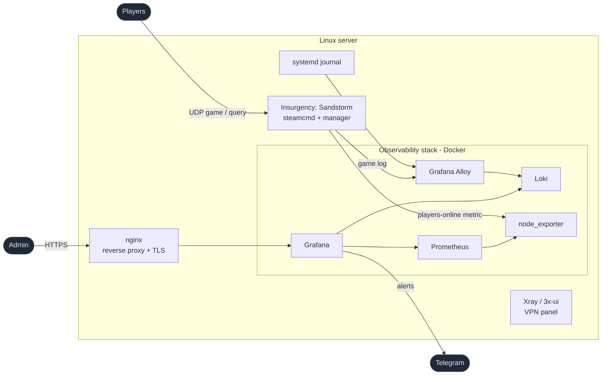

# Server Infrastructure as Code

Ansible automation that takes a clean Ubuntu host and provisions a complete,
production-grade Linux server: base hardening, Docker, a full **observability
stack** (metrics **and** logs with Telegram alerting), an Nginx reverse proxy
with TLS, an Xray (3x-ui) VPN panel, and a dedicated **Insurgency: Sandstorm**
game server — all described as code and fully **idempotent**.

The same roles target multiple hosts through Ansible inventory groups — a test
host and production — so changes are validated before they reach the live
server. The repository is the single source of truth for *configuration* and is
designed to rebuild the server from scratch for disaster recovery.

> Hostnames, IPs and the live firewall port map are intentionally **not** in the
> repo. Public placeholders (`YOUR_IP`, `example.duckdns.org`) stand in for
> real values; concrete non-standard ports live encrypted in Ansible Vault.

## Highlights

- **Eight focused roles**, one responsibility each, composed by a single `site.yml`.
- **Idempotent by design** — a second run reports `changed=0`; version-pinned,
  heavy installs (steamcmd, 3x-ui) only act when state actually differs, so
  re-runs never disturb live services.
- **Observability as code** — Prometheus, Grafana, Loki, node_exporter and Alloy,
  with datasources, dashboards, alert rules, contact points and notification
  policies all provisioned from files (no click-ops).
- **Secrets in Ansible Vault** — the repo shows *which* secrets exist, never their
  values; the vault password lives outside the repo.
- **Two environments from one codebase** — a test host and production,
  differing only through `group_vars`.
- **Disaster-recovery aware** — stateful data (VPN DB, TLS certs) is backed up
  out-of-band and restored through role variables; see [docs/MIGRATION.md](docs/MIGRATION.md).

## Architecture



## Roles

| Role | What it does |
|------|--------------|
| `common`     | Base packages, timezone, apt hygiene |
| `security`   | UFW firewall, fail2ban (systemd backend), SSH hardening drop-in |
| `docker`     | Docker CE + Compose plugin from Docker's official apt repository |
| `monitoring` | node_exporter + Prometheus + Grafana via Compose; datasources, dashboards, alert rules, Telegram contact point and notification policy — all provisioned as code |
| `logging`    | Loki + Grafana Alloy via Compose; tails the game log and the systemd journal, 7-day retention, queryable in the same Grafana |
| `nginx`      | Reverse proxy to Grafana, websocket upgrade, security headers, optional TLS (Let's Encrypt restore) |
| `xray`       | Native 3x-ui install (pinned binary + systemd), one-time DB restore |
| `sandstorm`  | steamcmd dedicated server, game configs, mod.io mods, a Python manager, and systemd units |

Applied in dependency order by `site.yml`: `common → docker → security →
monitoring → logging → nginx → xray → sandstorm`.

## Repository layout

```
ansible/
├── ansible.cfg
├── site.yml                       # entry point — the whole stack
├── inventory/
│   ├── hosts.yml                  # inventory host groups
│   └── group_vars/
│       ├── all/
│       │   ├── main.yml           # shared vars + secret aliases
│       │   └── vault.yml          # ansible-vault encrypted secrets
│       ├── lab.yml                # non-production host overrides
│       └── production.yml         # production overrides (ports via vault)
└── roles/                         # one responsibility per role
docs/MIGRATION.md                  # disaster-recovery / new-host runbook
scripts/backup-state.sh            # backs up stateful data the playbook does not manage
```

## Environments

The same roles target multiple hosts through Ansible inventory groups — a test
host (the default) and production — so changes are validated before they reach
the live server. Everything that differs — ports, TLS, hostnames, firewall
rules, which services run — is expressed entirely through `group_vars`, never by
editing roles. The game server and its log shipping, for example, are enabled on
production only.

## Secrets & Vault

All secrets live in `inventory/group_vars/all/vault.yml`, encrypted with
**Ansible Vault** (AES-256). Plaintext aliases in `all/main.yml` and
`production.yml` reference the encrypted values, so the repo documents *which*
secrets exist without ever exposing them:

- Grafana admin password
- Telegram bot tokens (a monitoring bot and a dedicated game bot) + chat id
- Sandstorm RCON password, GSLT, and game-stats tokens
- mod.io API token
- Production network topology (non-standard SSH / panel / VPN ports)

The vault password is kept outside the repository. The encrypted `vault.yml`
**is** committed — that is what makes a clean clone able to rebuild production.

## Observability

A single Grafana fronts both pillars:

**Metrics** — `node_exporter` (incl. a systemd unit-state textfile collector) is
scraped by Prometheus and visualised in Grafana. Provisioned dashboards:

- *Node Exporter Full* — host vitals.
- *Insurgency: Sandstorm* — a custom dashboard correlating **players online**
  against the **busiest CPU core**. The game server is single-threaded, so
  average CPU hides saturation; the busiest-core view is what actually predicts
  gameplay impact.

**Logs** — Grafana Alloy tails the game log and the systemd journal and ships
them to Loki (7-day retention, enforced by the compactor). Player names are kept
in the log line but never as a label, to keep Loki's index cardinality bounded.

**Alerting** — Grafana alert rules (provisioned as code) page a Telegram channel:
busiest CPU core > 90% for 10 min, RAM > 90%, disk > 85%, and any monitored
systemd service going inactive.

## Security

- **UFW** default-deny with an explicit allow-list per role.
- **fail2ban** (systemd backend) with SSH and nginx jails.
- **SSH hardening** drop-in; key-only by default (production keeps password auth
  as a deliberate, fail2ban-covered fallback on a non-standard port).
- **RCON is never exposed** — it binds loopback and is reached over an SSH
  tunnel; the firewall never opens its port.

## Usage

```bash
cd ansible

# Test host (default target)
ansible-playbook site.yml

# Dry run — shows the diff, changes nothing
ansible-playbook site.yml --check --diff

# Production (explicit, never the default)
ansible-playbook site.yml -e target_hosts=production

# Re-apply just one slice (tagged roles)
ansible-playbook site.yml --tags monitoring,logging
```

Provide the connection details (host, key) at run time so they stay out of the
repo, e.g. `-e ansible_host=YOUR_IP -e ansible_ssh_private_key_file=...`.

## Disaster recovery

The repo is the source of truth for *configuration* only. Stateful data — the
VPN database, TLS certificates, game saves, metric history — is **not** in the
repo. `scripts/backup-state.sh` captures the non-reproducible pieces (the 3x-ui
database and Let's Encrypt certificates) so they can be restored on a fresh host
through role variables. The full new-host runbook is in
[docs/MIGRATION.md](docs/MIGRATION.md).

## Design principles

- **Idempotent** — declare desired state, converge to it, re-run safely.
- **Pinned versions** — reproducibility over freshness for every image and binary.
- **One responsibility per role**, composed rather than monolithic.
- **Secrets and host specifics out of the repo** — vault for values, `group_vars`
  and run-time `-e` for everything environment-specific.
